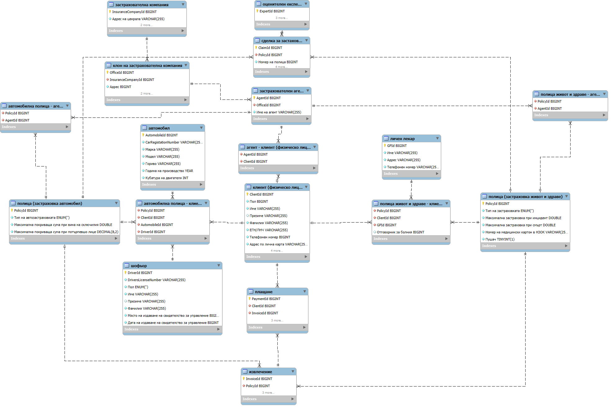

# Insurance Company
Showing my Final Databases Course Project at The Technical University of Sofia. You can see a complete Database Architecture and Design, based on MySQL.
The database is primarily designed in Bulgarian and then translated to English.

# What is used
The tables have user-defined Constraints and are connected with complicated relationships. One-to-many and Many-to-Many relationships are used in this project.
You can see a couple of Stored Procedures and Triggers in the ManipulationScripts folder, that can help automating the process of insertion and deletion and be used by non-programmers.
